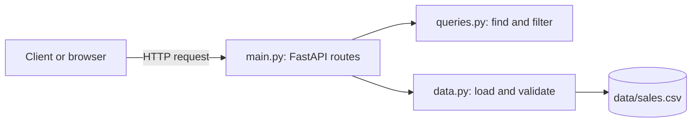

# Sales API Service

A small REST API that serves sales data over HTTP, built with Python and FastAPI.

## The problem it solves

Sales data stored in a CSV file is hard to reuse: every program that needs it has to open the file and parse it by itself. This project puts a simple API in front of the data, so any client can ask for exactly what it needs over HTTP and get clean JSON back. It is meant for developers and analysts who want to query orders without dealing with the CSV file directly.

## Features

- List all orders with `GET /sales`
- Get a single order by its ID with `GET /sales/{order_id}`
- Filter orders by region with `GET /sales?region=EU-West` (not case-sensitive)
- Clear error responses: `404` for an unknown order, `503` when the data cannot be loaded
- Interactive documentation generated automatically at `/docs`
- 20 automated tests that run on every push with GitHub Actions

## Requirements

- [Git](https://git-scm.com/)
- [uv](https://docs.astral.sh/uv/), which also installs the correct Python version automatically

## Installation

```bash
git clone https://github.com/korneldul/sales-api-service.git
cd sales-api-service
uv sync
```

## Usage

Start the server:

```bash
uv run uvicorn sales_api_service.main:app --app-dir src --reload
```

The API is now available at http://127.0.0.1:8000. Open http://127.0.0.1:8000/docs to try every endpoint in the browser.

### Endpoints

| Method | Path | Description |
|--------|------|-------------|
| GET | `/` | Service name and list of endpoints |
| GET | `/sales` | All 300 orders |
| GET | `/sales?region=EU-West` | Only orders from the given region |
| GET | `/sales/{order_id}` | One order, for example `/sales/ORD-1001` |

Available regions: `EU-West`, `EU-East`, `EU-North`, `EU-South`.

### Example request

```bash
curl http://127.0.0.1:8000/sales/ORD-1001
```

Response:

```json
{
  "order_id": "ORD-1001",
  "date": "2025-03-04",
  "product": "CloudSync",
  "category": "Software",
  "units": 1,
  "unit_price": 373.35,
  "region": "EU-East"
}
```

### Example error

An order that does not exist returns status `404`:

```json
{
  "detail": "Order ORD-0000 not found"
}
```

If the data file is missing, empty or damaged, the API returns status `503` with a message that describes the problem.

## How it works



- `data.py` reads `data/sales.csv`, converts numeric fields to numbers and raises a clear error for a missing, empty or malformed file.
- `queries.py` contains two small functions: one finds an order by ID, the other filters orders by region.
- `main.py` defines the HTTP endpoints and turns errors into proper status codes.

## Project structure

```
sales-api-service/
├── src/sales_api_service/   # application code
├── tests/                   # pytest tests
├── data/                    # synthetic sales data
├── .github/workflows/       # CI workflow
├── pyproject.toml           # dependencies (uv)
└── README.md
```

## Running the tests

```bash
uv run pytest
```

The same command runs automatically on every push through GitHub Actions.

## Tech stack

- Python
- FastAPI and Uvicorn
- pytest and httpx for testing
- uv for dependency and environment management
- GitHub Actions for continuous integration

## About the data

All data in `data/sales.csv` is synthetic (invented). It contains 300 orders with order ID, date, product, category, units, unit price and region. No real company or personal data is included.